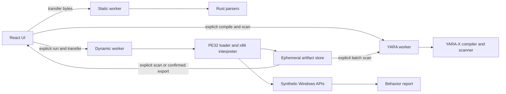

# Aegis security model

## Security objective

Aegis lets an analyst inspect an untrusted binary without transmitting it or
letting it execute as host code. Static analysis treats every sample as bytes.
Dynamic analysis interprets guest x86 instructions and models a small Windows
environment; it never passes guest code to the browser's WebAssembly engine or
the host CPU.

Uploaded WebAssembly is parsed with `wasmparser` and is never instantiated.

## Trust boundaries

The trusted computing base consists of the current browser, the Aegis
JavaScript and WebAssembly bundles, Rust dependencies recorded in the lockfile,
and the static server delivering those files. The uploaded sample and every
derived string, symbol, address, count, instruction, and API argument are
untrusted.

The UI transfers a sample `ArrayBuffer` to the static worker. Dynamic analysis
starts a separate worker and transfers a fresh buffer to it. Neither worker has
DOM access. Cancelling, timing out, closing, replacing, or crashing terminates
the relevant worker and drops its buffer and linear memory.

## Enforced controls

Static analysis:

- 128 MiB maximum input and a 30-second worker watchdog
- 4,096 sections and 50,000 records per large collection
- 50,000 strings, 4 KiB per string, and 8 MiB aggregate string data
- 64 KiB maximum worker hex response; the UI requests 512-byte pages
- Magic-based detection instead of trusting a filename or MIME type

Dynamic analysis:

- PE32/x86 and PE64/x86-64 only; other formats remain static-only
- Explicit user initiation after static analysis
- Separate worker and a 10-second UI watchdog
- 1,000,000 instructions and 2,000 trace records by default
- Hard ceilings of 10,000,000 instructions, 5,000 traces, 100,000 API calls,
  and 256 MiB of mapped guest memory
- Deterministic virtual time and synthetic handles
- Four bounded deterministic environment presets vary synthetic Windows version,
  identity, locale, timezone, CPU/RAM, debugger state, clock, and network disposition
- A profile matrix is limited to four sequential runs in one worker; each run retains
  the same instruction, memory, trace, API, artifact, and watchdog boundaries
- In-memory files, registry keys, network sink, process events, mappings, and
  synthetic remote-process address spaces
- 4,096 live handles, 1 MiB per virtual file, and 16 MiB total virtual file data
- Kernel objects, enumeration snapshots, restricted tokens, shared mappings, named
  pipes, resources, and crypto providers are synthetic handles under the same limit
- Crypto hash input is capped at 4 MiB per handle; it never invokes host key stores
- Network scenarios are limited to 32 DNS, 32 HTTP, and 32 socket entries, 1 MiB
  per response, 4 MiB total response bytes, 64 headers, and three redirect hops
- Scripted downloads enter the existing 4 MiB artifact boundary; reports and
  synthetic-PCAP JSON contain metadata and previews, never response body bytes
- Provenance tracking retains at most 256 sources, 4,096 labeled ranges, 4,096
  security-relevant flows, and eight source labels per range; it stores labels
  and metadata rather than another copy of guest bytes
- Execution snapshots are capped at 256 per run. Each state hash samples at most
  the first and last 512 bytes of 64 dirty regions; reports contain registers,
  counters, and hashes but no raw guest-memory snapshot bytes
- 4 MiB per synthetic remote-memory region and 16 MiB total remote-process memory
- Bounded synthetic PEB/TEB structures and process environments reveal no host values;
  x86 uses `FS` and x64 uses `GS:[0x30]`/`GS:[0x60]` conventions
- PE64 execution uses sparse `u64` guest addresses, Microsoft x64 RCX/RDX/R8/R9
  register arguments, 32-byte shadow space, and bounded stack arguments. Reported
  fixture addresses remain below JavaScript's exact-integer ceiling
- PE64 exception-directory parsing retains at most 4,096 `RUNTIME_FUNCTION`
  records. Vectored exception dispatch records the matching runtime function when
  present, but full x64 language-specific unwinding is not executed
- Guest x86 SEH and x64 vectored dispatch visit at most 16 handlers per exception
  and retain at most 128 exception events; records and contexts live only in
  synthetic guest memory
- Guest scheduling is limited to 64 threads and 4,096 scheduler events. It is
  cooperative and deterministic; no sample instruction creates a browser or host thread
- Dynamic symbol resolution creates emulator-owned API stubs only; resolved
  addresses never refer to browser or host functions
- TLS callbacks execute under the same instruction, time, memory, and worker limits
- Remote allocation, process writes, and thread creation are correlated as report
  events but never target or create a host process
- Runtime artifact capture is limited to 128 unique artifacts, 4 MiB per artifact,
  and 32 MiB total retained bytes; ordinary UI reads are capped at 64 KiB
- Payload lineage is limited to 256 distinct generations. A generation is metadata
  linked to an already bounded artifact and never adds another raw-byte copy
- Artifact bytes remain in the dynamic worker for the session. Reports contain only
  bounded metadata, and raw-byte export requires a per-artifact confirmation
- Unsupported instructions and invalid reads, writes, or execution become
  structured termination reasons
- SSE2 state is limited to eight 128-bit guest registers and x87 state to an
  eight-value stack; unsupported encodings retain only bounded nearby trace context

YARA analysis:

- Explicit analyst initiation in a separate, lazy-loaded worker
- 1 MiB rule-source and 128 MiB sample limits
- 5-second compilation and 10-second scan watchdogs enforced by worker termination
- Runtime artifact batch scans are explicit, limited to 128 artifacts and 32 MiB,
  and use a 15-second watchdog
- 10,000 compiled rules, 100 diagnostics, 5,000 matching rules, 10,000 reported
  occurrences, and 100 occurrences per pattern
- Includes disabled; slow patterns and loops rejected at compile time
- Unsupported environment-facing modules rejected; PE, ELF, Mach-O, .NET, hash,
  math, string, and time modules are bundled locally
- Rule source is ephemeral and never fetched remotely or saved automatically
- Reports include offsets and metadata but exclude matched sample bytes and rule source

Application controls:

- Parser and interpreter failures become errors or bounded reports
- Sample values render as React text; no raw HTML or clickable IOC links
- No telemetry, analytics, external fonts, remote reputation, or third-party assets
- CSP limits scripts, workers, and connections to the same origin
- No automatic localStorage, IndexedDB, OPFS, service-worker, or server persistence
- No original sample bytes, runtime artifact bytes, or custom YARA source in exported reports

`connect-src 'self'` permits workers to fetch same-origin analyzer Wasm and the
bundled safe fixture. No guest network API maps to `fetch`, WebSocket, WebRTC, or
any browser network primitive. Browser tests assert that complete static and
dynamic workflows create no third-party requests.

## Guarantees and non-guarantees

Aegis prevents application-level native execution and bounds ordinary parser
and interpreter resource use. It cannot make a browser, WebAssembly runtime,
compiler, or dependency invulnerable. Use a fully updated browser and an
isolated profile or machine for highly sensitive samples.

Static and emulated behavior are evidence, not a malware verdict. Packed,
encrypted, self-modifying, multi-process, kernel-mode, environment-dependent,
or runtime-downloaded behavior may be missed. The current interpreter is not a
complete x86 CPU or Windows implementation; a sample can evade or simply exceed
its supported surface.

PE64 support covers core integer, memory, control-flow, RIP-relative, and Microsoft
x64 ABI behavior plus the milestone parity surfaces for runtime artifacts and
payload generations, synthetic files/registry/scripted WinINet, API-level
provenance, deterministic guest threads, and bounded vectored exception dispatch.
It does not duplicate every PE32 API model, x86 `FS:[0]` SEH chain, or full Windows
x64 language-specific unwinding; unsupported paths terminate with structured
diagnostics.

Provenance is intentionally API-level and follows modeled range writes, copies,
conversions, and crypto outputs. It is not whole-CPU taint propagation or symbolic
execution, so unmodeled instruction-only transformations can break a data-flow chain.

Snapshot state hashes are deterministic bounded fingerprints, not complete memory
images. Matching hashes increase confidence that modeled states align; they do not
prove that every unsampled byte or unmodeled guest state is identical.

Full guest-OS virtualization is outside this product boundary. Adding an API is
acceptable only when its implementation remains deterministic and cannot reach
the real browser filesystem, network, DOM, clipboard, storage, or host process
facilities.
