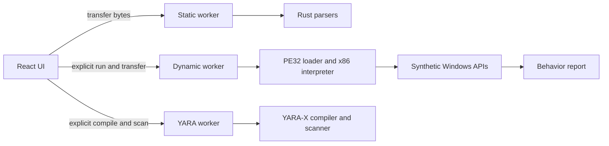

# Aegis security model

## Security objective

Aegis lets an analyst inspect an untrusted binary without transmitting it or
letting it execute as host code. Static analysis treats every sample as bytes.
Dynamic analysis interprets guest x86 instructions and models a small Windows
environment; it never passes guest code to the browser's WebAssembly engine or
the host CPU.

Uploaded WebAssembly is parsed with `wasmparser` and is never instantiated.

## Trust boundaries

The trusted computing base consists of the current browser, the Aegis
JavaScript and WebAssembly bundles, Rust dependencies recorded in the lockfile,
and the static server delivering those files. The uploaded sample and every
derived string, symbol, address, count, instruction, and API argument are
untrusted.

The UI transfers a sample `ArrayBuffer` to the static worker. Dynamic analysis
starts a separate worker and transfers a fresh buffer to it. Neither worker has
DOM access. Cancelling, timing out, closing, replacing, or crashing terminates
the relevant worker and drops its buffer and linear memory.

## Enforced controls

Static analysis:

- 128 MiB maximum input and a 30-second worker watchdog
- 4,096 sections and 50,000 records per large collection
- 50,000 strings, 4 KiB per string, and 8 MiB aggregate string data
- 64 KiB maximum worker hex response; the UI requests 512-byte pages
- Magic-based detection instead of trusting a filename or MIME type

Dynamic analysis:

- PE32/x86 only; other formats remain static-only
- Explicit user initiation after static analysis
- Separate worker and a 10-second UI watchdog
- 1,000,000 instructions and 2,000 trace records by default
- Hard ceilings of 10,000,000 instructions, 5,000 traces, 100,000 API calls,
  and 256 MiB of mapped guest memory
- Deterministic virtual time and synthetic handles
- In-memory files, registry keys, network sink, process events, mappings, and
  synthetic remote-process address spaces
- 4,096 live handles, 1 MiB per virtual file, and 16 MiB total virtual file data
- 4 MiB per synthetic remote-memory region and 16 MiB total remote-process memory
- A bounded synthetic PEB/TEB and process environment that reveal no host values
- Dynamic symbol resolution creates emulator-owned API stubs only; resolved
  addresses never refer to browser or host functions
- TLS callbacks execute under the same instruction, time, memory, and worker limits
- Remote allocation, process writes, and thread creation are correlated as report
  events but never target or create a host process
- Unsupported instructions and invalid reads, writes, or execution become
  structured termination reasons

YARA analysis:

- Explicit analyst initiation in a separate, lazy-loaded worker
- 1 MiB rule-source and 128 MiB sample limits
- 5-second compilation and 10-second scan watchdogs enforced by worker termination
- 10,000 compiled rules, 100 diagnostics, 5,000 matching rules, 10,000 reported
  occurrences, and 100 occurrences per pattern
- Includes disabled; slow patterns and loops rejected at compile time
- Unsupported environment-facing modules rejected; PE, ELF, Mach-O, .NET, hash,
  math, string, and time modules are bundled locally
- Rule source is ephemeral and never fetched remotely or saved automatically
- Reports include offsets and metadata but exclude matched sample bytes and rule source

Application controls:

- Parser and interpreter failures become errors or bounded reports
- Sample values render as React text; no raw HTML or clickable IOC links
- No telemetry, analytics, external fonts, remote reputation, or third-party assets
- CSP limits scripts, workers, and connections to the same origin
- No automatic localStorage, IndexedDB, OPFS, service-worker, or server persistence
- No original sample bytes or custom YARA source in exported reports

`connect-src 'self'` permits workers to fetch same-origin analyzer Wasm and the
bundled safe fixture. No guest network API maps to `fetch`, WebSocket, WebRTC, or
any browser network primitive. Browser tests assert that complete static and
dynamic workflows create no third-party requests.

## Guarantees and non-guarantees

Aegis prevents application-level native execution and bounds ordinary parser
and interpreter resource use. It cannot make a browser, WebAssembly runtime,
compiler, or dependency invulnerable. Use a fully updated browser and an
isolated profile or machine for highly sensitive samples.

Static and emulated behavior are evidence, not a malware verdict. Packed,
encrypted, self-modifying, multi-process, kernel-mode, environment-dependent,
or runtime-downloaded behavior may be missed. The current interpreter is not a
complete x86 CPU or Windows implementation; a sample can evade or simply exceed
its supported surface.

Full guest-OS virtualization is outside this product boundary. Adding an API is
acceptable only when its implementation remains deterministic and cannot reach
the real browser filesystem, network, DOM, clipboard, storage, or host process
facilities.
